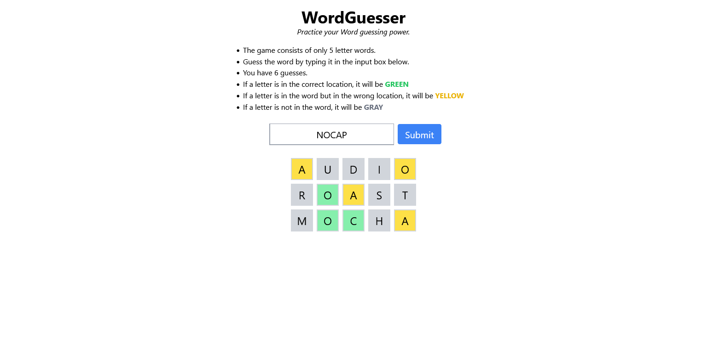

## WordGuesser

A Wordle clone built with Next.js, TypeScript and Tailwind CSS.

### Features

-   Guess the 5-letter word in 6 attempts
-   Correct/Incorrect letter position guesses are color coded Green/Yellow

### Technologies

### How to run

-   Clone this repository to your local system.
-   cd to the project directory on terminal and type `npm run dev`
-   Go to url: http://localhost:3000 in your browser to play the game.

### Preview

  

### Support Development

  

